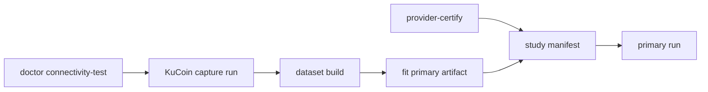

# Schema-v8 Runbook

## Preflight

```bash
python3 -m pip install -e '.[dev]'
make test
make lint
make compile
./scripts/exchange-q doctor --profile diagnostic
```

## Diagnostic profile

Default diagnostic runs stop after **10 slots** (`max_terminal_slots=10`), about
10 minutes at one slot per minute.

```bash
./scripts/exchange-q run --profile diagnostic --view outcome
./scripts/exchange-q run --profile diagnostic --view detail
```

### Extended diagnostic (longer HTX pipeline test)

```bash
./scripts/exchange-q run --profile diagnostic --view outcome \
  --max-terminal-slots 60 \
  --refresh-s 1
```

Approximate duration: one slot per minute. Examples:

| `--max-terminal-slots` | Approximate duration |
|------------------------|----------------------|
| 60 | 1 hour |
| 180 | 3 hours |
| 360 | 6 hours |

Resume an interrupted run:

```bash
./scripts/exchange-q run --profile diagnostic --view outcome \
  --database runs/btcusdt-diagnostic-YYYYMMDD-HHMMSS-xxxxxxxx.sqlite3 \
  --run-id btcusdt-diagnostic-YYYYMMDD-HHMMSS-xxxxxxxx \
  --artifact artifacts/v8/diagnostic-born.json \
  --resume \
  --max-terminal-slots 60
```

Diagnostic runs use HTX and the bundled four-row
`artifacts/v8/diagnostic-born.json` fixture. The dashboard shows slot tallies
(`SLOTS`, `EXCLUSIONS`) and labels captured buy-share as **diagnostic capture —
not scored**.

Press `Ctrl-C` to stop. Open slots are cancelled atomically before the run
terminates.

## Inspect and analyze

Use the **exact** run ID and database path from the run summary (not placeholders):

```bash
./scripts/exchange-q status \
  --database runs/btcusdt-diagnostic-20260728-143448-99be3c8a.sqlite3 \
  --run-id btcusdt-diagnostic-20260728-143448-99be3c8a \
  --json

./scripts/exchange-q analyze \
  --database runs/btcusdt-diagnostic-20260728-143448-99be3c8a.sqlite3 \
  --run-id btcusdt-diagnostic-20260728-143448-99be3c8a

./scripts/exchange-q export \
  --database runs/btcusdt-diagnostic-20260728-143448-99be3c8a.sqlite3 \
  --run-id btcusdt-diagnostic-20260728-143448-99be3c8a \
  --output artifacts/export-diagnostic.json
```

HTX diagnostic runs typically report `analysis_available: false` with
`reason: no scoreable labels` — that is expected.

## Primary bootstrap pipeline

Primary/scoreable evidence requires KuCoin sequenced capture (default primary
provider), a primary artifact, live certification, and a study manifest. Binance
remains available where reachable but is blocked in some regions (e.g. Iran).

### Preflight connectivity

Before a long capture run, verify the provider from your network:

```bash
./scripts/exchange-q doctor --profile diagnostic \
  --provider kucoin-sequenced --connectivity-test
```

Expect `connectivity.reachable: true` with at least one trade and one book event
within the soak window.



### Step 1 — KuCoin capture (diagnostic profile, provider override)

```bash
./scripts/exchange-q run --profile diagnostic --view detail \
  --provider kucoin-sequenced \
  --max-terminal-slots 120 \
  --refresh-s 1 \
  --database runs/btcusdt-capture-dev.sqlite3 \
  --run-id btcusdt-capture-dev
```

About 120 minutes for 120 slots. Increase `--max-terminal-slots` for more history.

The dashboard shows **GOALS** (run targets), **PROGRESS**, and **BLOCKER** when
no market events arrive (provider blocked or unreachable).

### Step 2 — Development dataset

```bash
./scripts/exchange-q dataset build \
  --capture-database runs/btcusdt-capture-dev.sqlite3 \
  --provider kucoin-sequenced \
  --symbol btcusdt \
  --output datasets/btcusdt-development.json
```

### Step 3 — Fit primary artifact

```bash
./scripts/exchange-q fit datasets/btcusdt-development.json \
  --purpose primary \
  --output artifacts/v8/btcusdt-born.json
```

### Step 4 — Provider certification (live soak)

```bash
./scripts/exchange-q provider-certify \
  --provider kucoin-sequenced \
  --symbol btcusdt \
  --duration-s 300 \
  --output certifications/kucoin-btcusdt.json
```

Use longer `--duration-s` (e.g. 3600) for production soak. Output must have
`valid: true` with `replay_results`, `fault_results`, and `live_soak` all passing.

### Step 5 — Study manifest and doctor

First live primary test uses [`studies/btcusdt-primary.json`](../studies/btcusdt-primary.json)
with `target_eligible: 5` (~5 hours at one slot per minute):

```bash
./scripts/exchange-q doctor --profile primary --study studies/btcusdt-primary.json
```

### Step 6 — Primary run

```bash
./scripts/exchange-q run --profile primary --view outcome \
  --study studies/btcusdt-primary.json \
  --refresh-s 1
```

Primary runs continue until `target_eligible` scoreable slots are collected (no
diagnostic slot cap).

### Step 7 — Analyze

```bash
./scripts/exchange-q analyze \
  --database runs/<run-id>.sqlite3 \
  --run-id <run-id>
```

## Iran / blocked exchanges

- **HTX** (`htx-ws`) works for extended diagnostic pipeline tests but cannot
  certify continuity for scoreable primary evidence.
- **Binance** (`binance-sequenced`) is blocked from some networks; use
  `kucoin-sequenced` instead.
- If capture shows `BLOCKER | NO MARKET EVENTS`, run the connectivity preflight
  above before retrying.

### WebSocket resilience and failed captures

`kucoin-sequenced` reconnects automatically when KuCoin closes the websocket.
Diagnostic capture runs may still end with `unscoreable` slots and exclusions
such as `provider_coverage_not_certifiable` — that is expected for capture-dev.

If a run ends with `status: failed` or `integrity: quarantined`, delete the
database and start a fresh capture. Do not `--resume` a quarantined run:

```bash
rm -f runs/btcusdt-capture-dev.sqlite3

./scripts/exchange-q run --profile diagnostic --view detail \
  --provider kucoin-sequenced --max-terminal-slots 120 --refresh-s 1 \
  --database runs/btcusdt-capture-dev.sqlite3 --run-id btcusdt-capture-dev
```

If you change `--max-terminal-slots` or other manifest fields for an existing
run ID, use a new database path or remove the old file first.

## Primary profile (fail-closed)

Primary runs require:

- a frozen study manifest
- a non-synthetic `purpose: primary` artifact
- a valid provider certification with replay, fault, and live soak sections

See the bootstrap pipeline above. Example study template:
[`studies/btcusdt-primary.example.json`](../studies/btcusdt-primary.example.json)
(full study target 720 slots).

## Resume

```bash
./scripts/exchange-q run \
  --profile diagnostic \
  --database runs/<run-id>.sqlite3 \
  --run-id <run-id> \
  --artifact artifacts/v8/diagnostic-born.json \
  --resume
```

Schema v7 databases are read-only under v8 and cannot be resumed. New schema-v8
databases are single-run; use a new database for every independent run.

## References

- [docs/SCHEMA_V8.md](SCHEMA_V8.md)
- [ARCHITECTURE.md](../ARCHITECTURE.md)
