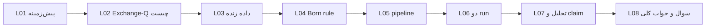

# درس ۰ — راهنمای مطالعه درسنامه‌ها

> **Superseded:** این نسخه برای schema v4 است. نسخه فعلی: [2026-07-27](../2026-07-27/00-raveshnama.md) + [SYSTEM_SNAPSHOT-2026-07-27.md](../SYSTEM_SNAPSHOT-2026-07-27.md).

## مشخصات نسخه

| فیلد | مقدار |
|------|--------|
| تاریخ درس | 2026-07-26 |
| snapshot سیستم | [SYSTEM_SNAPSHOT-2026-07-26.md](../SYSTEM_SNAPSHOT-2026-07-26.md) |
| commit مرجع | `5495b86` |
| پیش‌نیاز | هیچ |

---

## سوالاتی که در این درس جواب می‌گیرید

1. چرا درسنامه جدا از README و RUNBOOK لازم است؟
2. هر درس چه بخش‌هایی دارد و به چه ترتیبی بخوانم؟
3. وقتی سیستم عوض شد، چطور بفهمم درس قدیمی است یا نه؟
4. «یاد گرفتم» یعنی چه — چه تمرینی باید بتوانید انجام دهید؟

---

## ۱. چرا درسنامه؟

مستندات فنی Exchange-Q (RUNBOOK، ARCHITECTURE، SCHEMA) برای **اجرا** خوب‌اند، برای **فهم عمیق** ناکافی‌اند:

- فرض می‌کنند reader می‌داند buy_ratio چیست.
- کمتر می‌گویند **چه claimی ممنوع است**.
- سوال نمی‌پرسند؛ فقط دستور می‌دهند.

درسنامه مثل **کلاس با معلم** است: اول سوال، بعد تدریس، بعد تمرین، آخر پاسخ دقیق.

---

## ۲. قالب هر درس

```text
[مشخصات نسخه]     ← تاریخ + snapshot — همیشه اول بخوانید
[سوالات درس]      ← ذهنتان را آماده می‌کند
[پیش‌زمینه لازم]  ← اگر ندارید، درس قبل
[تدریس]           ← ساده، با مثال
[نگاه انتقادی]    ← محدودیت‌ها و دام‌ها
[کار عملی]        ← دستور یا تمرین کوتاه
[پاسخ سوالات]     ← انتهای درس — با خودتان چک کنید
```

---

## ۳. مسیر پیشنهادی



| اگر شما… | شروع از… |
|----------|----------|
| هیچ پیش‌زمینه ندارید | L01 |
| برنامه‌نویس هستید، بازار نمی‌دانید | L01 بخش بازار، بعد L03 |
| فقط می‌خواهید run بزنید | L05 + L06 + snapshot |
| می‌خواهید نتیجه را قضاوت کنید | L07 حتماً |

---

## ۴. نسخه‌بندی — قانون طلایی

**قبل از هر تصمیم علمی یا ops روی run زنده:**

1. باز کنید: `SYSTEM_SNAPSHOT-YYYY-MM-DD.md` همان روز (یا نزدیک‌ترین).
2. چک کنید: `schema_version`, `MIN_SIGNIFICANCE_N`, دستور start script.
3. اگر commit repo جلوتر رفت → snapshot جدید یا بپرسید «درس به‌روز هست؟».

درس 2026-07-26 با **schema v4** و **دو run موازی** (production + exploratory) هم‌خوان است.

---

## ۵. کار عملی — چک‌لیست «فهمیدم»

- [ ] می‌توانم تفاوت production (3600s) و exploratory (60s) را توضیح دهم.
- [ ] می‌دانم چرا run قدیمی v3 با 720 step **نامعتبر** است.
- [ ] می‌دانم قبل از n=720 چه claimی **ممنوع** است.
- [ ] می‌توانم `monitor_live.sh` و `monitor_exploratory.sh` را جدا بخوانم.

---

## پاسخ سوالات این درس

**۱. چرا درسنامه؟**  
چون نیاز به تدریس تدریجی، انتقاد، و Q&A دارید — نه فقط لیست دستور.

**۲. قالب و ترتیب؟**  
مشخصات → سوالات → تدریس → انتقاد → عمل → پاسخ. ترتیب L01→L08 (یا مسیر جدول بالا).

**۳. درس قدیمی؟**  
تاریخ درس + SYSTEM_SNAPSHOT را با commit و RUNBOOK فعلی مقایسه کنید.

**۴. «یاد گرفتم»؟**  
وقتی چک‌لیست بخش ۵ را **بدون نگاه به متن** انجام دهید.

---

**درس بعد:** [01-pishzamineh.md](./01-pishzamineh.md)
