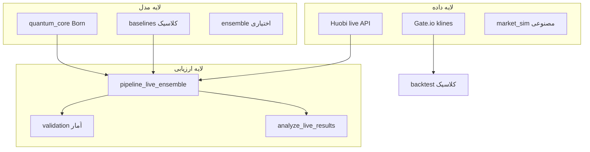

# درس ۲ — Exchange-Q چیست و چه نیست؟

## مشخصات نسخه

| فیلد | مقدار |
|------|--------|
| تاریخ درس | 2026-07-26 |
| snapshot | [SYSTEM_SNAPSHOT-2026-07-26.md](../SYSTEM_SNAPSHOT-2026-07-26.md) |
| پیش‌نیاز | [L01](./01-pishzamineh.md) |

---

## سوالات این درس

1. Exchange-Q دقیقاً چه مشکلی را حل می‌کند؟
2. چرا Born rule از backtest کندل حذف شد؟
3. «Production-ready» اینجا یعنی چه — bot معامله‌گر؟
4. چه ادعاهایی **ممنوع** است حتی اگر log سبز باشد؟
5. سه لایه پروژه (داده / مدل / ارزیابی) کجا هستند؟

---

## تدریس — نقشه سه لایه

---

## Exchange-Q **هست**

| هست | توضیح |
|-----|--------|
| پلتفرم research | جمع‌آوری evidence برای «آیا Born روی buy_ratio بهتر از baseline است؟» |
| Live evaluator | fetch → forecast → resolve → ذخیره schema v4 |
| مقایسه paired | هر گام: quantum vs classical روی **همان** actual |
| reproducible run | run_id, config_hash, SQLite |

---

## Exchange-Q **نیست**

| نیست | چرا مهم است |
|------|--------------|
| ربات ترید | سفارش به صرافی نمی‌فرستد |
| تضمین سود | net_return شبیه‌سازی signal است |
| مدل LLM / deep learning | قانون Born + baseline دستی |
| backtest کندل = live | target متفاوت (جهت vs buy_ratio) |
| «کوانتوم واقعی» | inspired فقط در نام مفهومی |

---

## چرا Born از klines حذف شد؟ (نگاه انتقادی)

تاریخچه پروژه: Born روی کندل‌های تاریخی تست شد → Bonferroni p=1.0 (هیچ برتری معنادار).

دلایل فنی (خلاصه):

1. **Target فرق کرد:** جهت باینری vs buy_ratio پیوسته.
2. **δ از returns کندل** با δ از order-book یکی نیست.
3. **ادعاهای بزرگ** بدون pre-register کافی بود.

**نتیجه عملی:** تنها مسیر کوانتومی که هنوز **شایسته جمع‌آوری evidence** است = **live Huobi**.

---

## «Production» یعنی چه؟

در snapshot 2026-07-26:

- **Production run** = 720 resolve با horizon 1 ساعت، schema v4، SQLite، resume.
- یعنی **quality engineering برای experiment** — نه deploy bot.

---

## ادعاهای ممنوع (تا n و quality درست نشود)

| ادعا | شرط مجاز |
|------|-----------|
| «Born ثابت شد بهتر است» | n≥720 eligible + quality OK + pre-register |
| «win rate 52% = پول» | هرگز بدون execution model |
| «smoke 20 تایی کافی است» | فقط diagnostics |
| «run v3 قدیمی 720 step» | **invalid** — fetch count bug |

---

## کار عملی

فایل `verification_report.md` را باز کنید — فقط بخش «Honest reading» را بخوانید. یک جمله بنویسید: «وضعیت فعلی corpus چه می‌گوید؟»

---

## پاسخ سوالات

**۱. مشکل؟**  
ارزیابی صادقانه: آیا Born-rule روی buy_ratio زنده از ensemble کلاسیک خطای کمتری دارد؟

**۲. حذف از klines?**  
Target و δ نامناسب + نتایج null — مسیر live order-book جایگزین شد.

**۳. Production?**  
Run 720 ساعته استاندارد evidence — نه trading bot.

**۴. ممنوع?**  
سود، significance زودهنگام، مخلوط schema، run invalid v3.

**۵. سه لایه?**  
داده (fetcher/historical) → مدل (quantum_core/baselines) → ارزیابی (pipeline/validation/analyzer).

---

**قبل:** [L01](./01-pishzamineh.md) | **بعد:** [L03](./03-dade-zande-buy-ratio.md)
