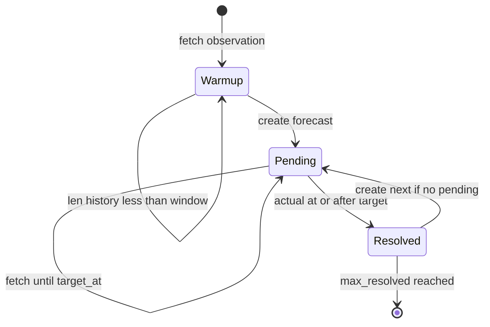

# درس ۵ — pipeline زنده: warmup، pending، resolve

## مشخصات نسخه

| فیلد | مقدار |
|------|--------|
| تاریخ درس | 2026-07-26 |
| snapshot | [SYSTEM_SNAPSHOT-2026-07-26.md](../SYSTEM_SNAPSHOT-2026-07-26.md) |
| کد | `core/pipeline_live_ensemble.py`, `core/live_store.py` |
| schema | v4 |
| پیش‌نیاز | [L04](./04-born-rule-sade.md) |

---

## سوالات این درس

1. چرا 15 observation اول فقط WARMUP است؟
2. «یک pending» یعنی چه — چرا SKIP forecast می‌بینیم؟
3. `--max-resolved 720` با `n_steps=720` قدیمی چه فرقی دارد؟
4. SQLite و JSON چه نقشی دارند — resume چطور؟
5. ensemble weights کی به‌روز می‌شوند — leakage چیست؟

---

## چرخه state machine



---

## پارامترهای CLI (named options)

```bash
python3 core/pipeline_live_ensemble.py \
  --symbol btcusdt \
  --mode quantum \
  --horizon-s 3600 \
  --sample-interval-s 60 \
  --window 15 \
  --max-resolved 720 \
  --resume RUN_ID    # اختیاری
```

| پارامتر | معنی |
|---------|------|
| horizon-s | زمان تا target resolve |
| sample-interval-s | فاصله fetch |
| max-resolved | **تعداد resolve eligible** برای توقف موفق |
| max-fetches | سقف fetch (0=نامحدود) |
| max-runtime-s | سقف زمانی |

**باگ تاریخی:** `n_steps=720` قدیمی = 720 **fetch** ≈ 12 ساعت — نه 720 ساعت forecast.

---

## forecast record (schema v4)

هنگام ساخت pending ذخیره می‌شود:

- `quantum_raw`, `classical`, `lookback_observation_ids`
- `target_at_ms`, `entry_quality_flags`
- `config_hash`, `model_version`

در resolve:

- `resolved_actual`, errors, `score_eligible`
- ensemble: `update_from_predictions(stored_raw)` — **نه** recompute از history جدید

---

## persistence

| فایل | نقش |
|------|-----|
| `{run_id}.sqlite3` | canonical (WAL) |
| `{run_id}.json` | export برای monitor/analyzer |
| `run_state` در SQLite | metadata + ensemble performance |

---

## log — ترجمه خطوط

| log | معنی |
|-----|------|
| `WARMUP (k/15)` | هنوز forecast نمی‌سازد |
| `status=pending target=HH:MM:SS` | forecast ساخته شد |
| `SKIP forecast — pending unresolved` | **نرمال** — منتظر horizon |
| `RESOLVED act=... c_err=... q_err=...` | یک گام تمام شد |

---

## کار عملی — production

```bash
./scripts/start_production_run.sh   # ترمینال 1 — دست نزنید
./scripts/monitor_live.sh
tail -f live_quantum_v3.log
```

---

## پاسخ سوالات

**۱. warmup?**  
مدل به 15 نقطه history نیاز دارد (`window`).

**۲. pending?**  
فقط یک forecast باز؛ تا resolve نشود جدید ساخته نمی‌شود → SKIP.

**۳. max-resolved vs n_steps?**  
max-resolved = هدف resolve؛ n_steps قدیمی = fetch count — invalid برای 720h claim.

**۴. SQLite/JSON?**  
SQLite برای resume و durability؛ JSON برای human/analyzer.

**۵. leakage?**  
weights فقط از prediction ذخیره‌شده در زمان forecast — نه از future history.

---

**بعد:** [L06](./06-dow-run-parallel.md)
