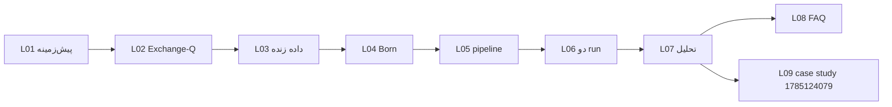

# درس ۰ — راهنمای مطالعه درسنامه‌ها

> **درس تاریخی (schema v5/model v1).** برای فرمان، نسخه و محدودیت ادعای فعلی از
> snapshot ۲۸ ژوئیه و مراجع v6 استفاده کنید.

## مشخصات نسخه

| فیلد | مقدار |
|------|--------|
| تاریخ درس | 2026-07-27 |
| snapshot سیستم | [SYSTEM_SNAPSHOT-2026-07-27.md](../SYSTEM_SNAPSHOT-2026-07-27.md) |
| schema | **v5** |
| commit مرجع | `5495b86` |
| پیش‌نیاز | هیچ |

### تغییرات نسبت به 2026-07-26

- schema v4 → **v5**؛ label از forward-window capture
- `data_policy_version` 3؛ null baseline در analyze
- production run `1785124007` فعال

---

## سوالاتی که در این درس جواب می‌گیرید

1. چرا درسنامه جدا از README و RUNBOOK لازم است؟
2. هر درس چه بخش‌هایی دارد و به چه ترتیبی بخوانم؟
3. وقتی سیستم عوض شد، چطور بفهمم درس قدیمی است یا نه؟
4. «یاد گرفتم» یعنی چه؟

---

## ۱. چرا درسنامه؟

RUNBOOK برای **اجرا** است؛ درسنامه برای **فهم + انتقاد + Q&A**.

---

## ۲. مسیر پیشنهادی

| اگر شما… | شروع از… |
|----------|----------|
| تازه‌کار | L01 |
| فقط run | L05 + L06 + snapshot |
| قضاوت نتایج | L07 + **L09** (case study n=280) |

---

## ۳. نسخه‌بندی

1. `SYSTEM_SNAPSHOT-2026-07-27.md` را بخوانید
2. `schema_version`, `data_policy_version`, run IDs را چک کنید
3. نسخه 2026-07-26 **superseded** است

**English:** [docs/en/guide/2026-07-27/00-study-guide.md](../../../en/guide/2026-07-27/00-study-guide.md)

---

## ۴. چک‌لیست «فهمیدم»

- [ ] تفاوت production (3600s) و exploratory (60s)
- [ ] `--max-resolved` ≠ fetch count قدیمی
- [ ] claim ممنوع قبل از n=720
- [ ] null baseline MAE(0.5) قبل از تفسیر MAE
- [ ] monitor_live vs monitor_exploratory

---

**درس بعد:** [01-pishzamineh.md](./01-pishzamineh.md)
